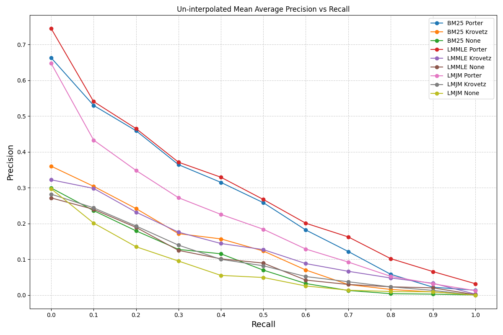
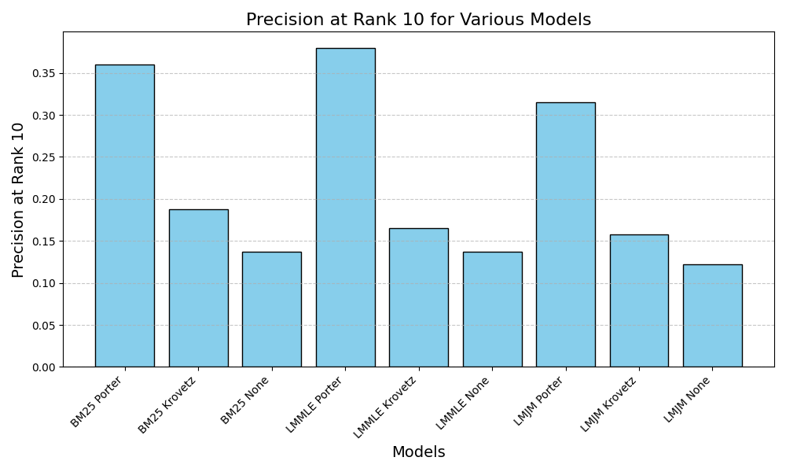
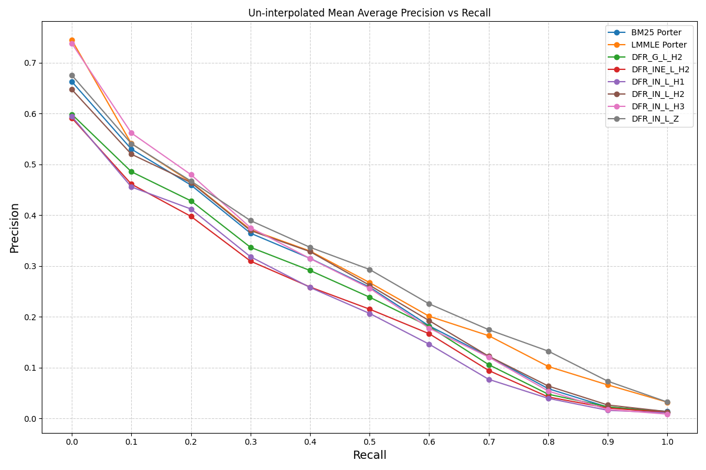
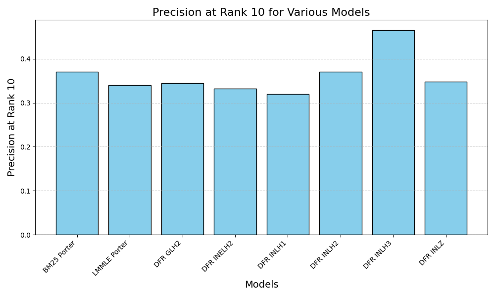
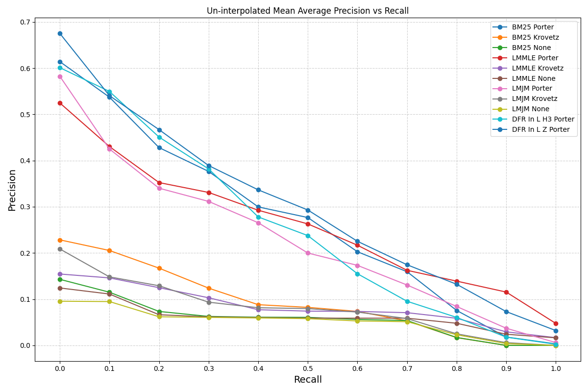
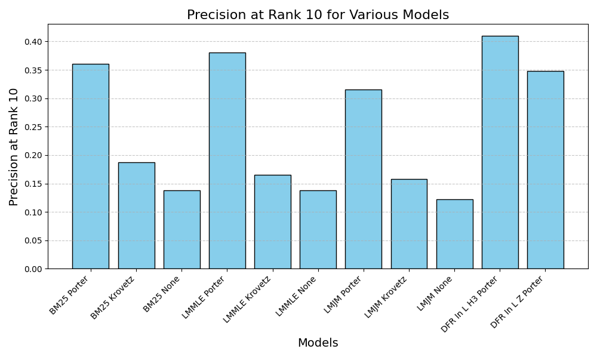
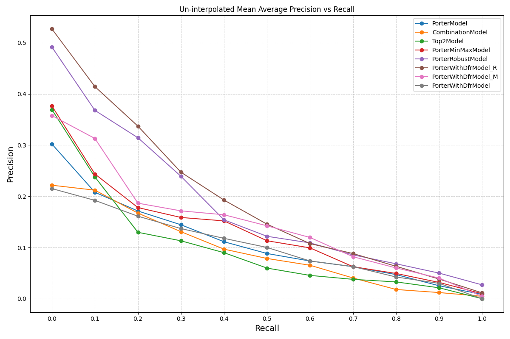
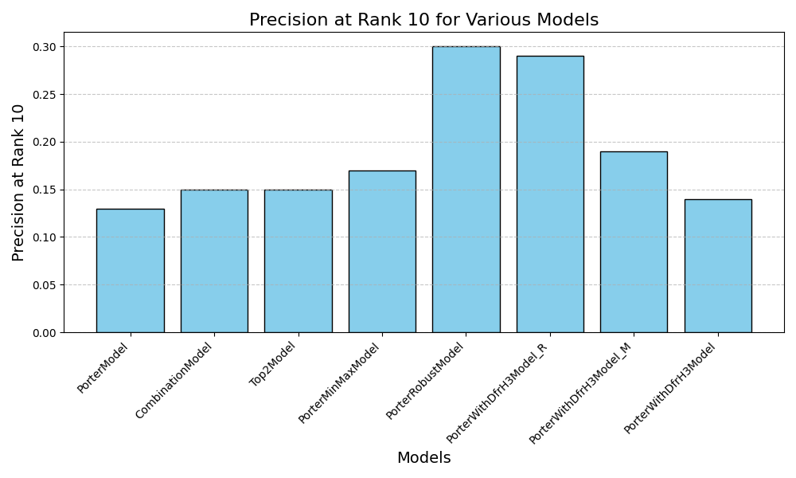

# WSM Project 2: Building IR systems based on the Pyserini Project

## What I did

**Part 1**

1.  Generate three kinds of index via command line (no stemming, portor stemmer, krovet stemmer)
2.  Use `autoclass` to spawn instance classes from Apache/Lucene's similarity package and create new classes based on `LuceneSearcher` so that custom searcher can use specified similarity. For instance:

    ```python
    class LMJelinekMercerSearcher(LuceneSearcher):
        pass
    ```

3.  Parse the queries and return top 1000 documents for each query in a single file.
4.  (_Addition_) Total 9 + 6 runs.
    -   3 (stemming methods) \* 3 (ranking functions)
    -   DFR 6 runs

**Part 2**

1.  Use 3 kinds of stemming methods and the combination of all methods to train 4 models (sklearn RandomForest) and compare their differences.
2.  (_Addition_) Total 11 + 8 runs.
    -   3 (stemming methods) \* 3 (ranking functions) + DFRSimilarity \* 2
    -   8 models

**Both**

1.  (_Addition_) Draw graphs of un-interpolated mean average precision.
2.  (_Addition_) Draw graphs of P@10.
3.  Analyze the results.

## Part 1: Ranking Functions

### Ranking Function Explanations

1.  OKAPI BM25 (**BM25**)

    BM25 Similarity is calculated as $\frac{freq}{freq+k_1 \cdot (1-b+\frac{b \cdot dl}{avgdl})}$ and with {$k_1$ = 2, $b$ = 0.75} will set BM25 to $\frac{tf}{tf+0.5+1.5*dl/avgdl}$

2.  Language modeling, maximum likelihood estimates with Laplace smoothing and estimated probability from corpus, query likelihood. (**LMMLE**)

    This uses `LMDirichletSimilarity` in Apache Lucene, as it aligns closely with the function provided.

    Formula:

    $$\rho_i = \frac{m_i+1}{n+t/k} + \frac{(t-k)/k \cdot P(w|C)}{n+t/k}$$

    Implementation in `LMDirichletSimilarity` (according to the score function in `LMDirichletSimilarity.java` from Apache Lucene):

    $$log(1+\frac{freq}{\mu \cdot P(w|C)}) + log{\frac{\mu}{dl+\mu}}$$

3.  Language modeling, Jelinek-Mercer smoothing using the corpus, 0.8 of the weight attached to the background probability, query likelihood. (**LMJM**)

    This uses `LMJelinekMercerSimilarity` in Apache Lucene, corresponding to the function provided.

    Formula:

    $$\rho_i = \lambda P(w|D) + (1-\lambda)P(w|C)$$

    Implementation in `LMJelinekMercerSimilarity` (according to the score function in `LMJelinekMercerSimilarity` from Apache Lucene):

    $$log(1 + \frac{(1-\lambda)P(w|D)}{\lambda P(w|C)})$$

4.  (_Addition_) DFRSimilarity (**dfr-basemodel-aftereffect-normalization**)

    `DFRSimilarity` is a flexible framework for scoring documents based on the _Divergence from Randomness_ model. It uses three main components:

    -   _Basic Model_: Determines how a term's distribution diverges from randomness.
    -   _After Effect_: Adjusts scores based on redundancy in term occurrence.
    -   _Normalization_: Accounts for document length or other properties.
    -   List of tried features:

        | BasicModel                                                                                     | AffterEffect          | Normalization | Display        |
        | ---------------------------------------------------------------------------------------------- | --------------------- | ------------- | -------------- |
        | G (Geometric Bose-Einstein model)                                                              | L (Laplace smoothing) | H2            | `DFR-G-L-H2`   |
        | Ine (Tf-idf model of randomness, based on a mixture of Poisson and inverse document frequency) | L                     | H2            | `DFR-Ine-L-H2` |
        | In (Basic tf-idf model of randomness)                                                          | L                     | H1            | `DFR-In-L-H1`  |
        | In                                                                                             | L                     | H2            | `DFR-In-L-H2`  |
        | In                                                                                             | L                     | H3            | `DFR-In-L-H3`  |
        | In                                                                                             | L                     | Z             | `DFR-In-L-Z`   |

### Generating Indexes

According to `python -m pyserini.index.lucene -options`, we can generate indexes with different stemmer via setting the `--stemmer` option to one of {none, krovet, porter}

### Part 1 Graphs (Pure ranking functions)

**Uninterpolated MAP**



**Precision at 10**



### Part 1 Graphs (With DFR Similarity)

**Uninterpolated MAP**



**Precision at 10 (With DFR Similarity)**



### Analysis

**Original MAP**

-   The BM25 and LMMLE models paired with the Porter stemmer consistently show higher precision across various recall levels compared to their counterparts.
-   Porter stemming generally outperforms Krovetz stemming and no stemming in most cases.
-   The top three models are all using Porter stemmer, which indicates that **aggressive stemming effectively reduces vocabulary mismatches and improves retrieval effectiveness**.
    -   According to my research, Krovetz Stemmer use a hybrid approach and focus on precision. It initally stems the words and checks the result stemmed words. If stemmed words aren't found in dictionary, the algorithm revert the stemmed words.
    -   Krovetz stemmer aims to maintain semantic and prevent over-stemming. In my opinion, this dataset isn't a very large one so that Porter stemmer have more term matches due to it's smaller vocabulary size.

**Smoothing Comparison**

Because `LMDirichletSimilarity` is using Dirichlet Prior Smoothing, so I'm comparing Dirichlet Prior Smoothing and Jelinek-Mercer Smoothing here.

-   Dirichlet Prior Smoothing

    Formula:

    $$P(w|D) = \frac{df + \mu P(w|C}{dl + \mu}$$

-   Jelinek-Mercer Smoothing

    Formula:

    $$P(w|D) = \lambda P(w|D) + (1-\lambda)P(w|C)$$

-   **Comparison**: Dirichlet smoothing adjusts the weight of the corpus probability based on the length of the document. For short documents, the corpus probability plays a larger role, whereas for longer documents, the term frequency in the document becomes more dominant. This makes Dirichlet smoothing more adaptive to datasets where document lengths vary significantly.
    -   Mean of WT2G's document length: 9278
    -   Variance: 495134949

**Additional Analysis of DFR Models**

-   After analysis of the original MAP graphs, I found that Porter stemmer with BM25, LMMLE model work really well. This led me to a question whether DFRSimilarity could match or even surpass these models in performance.
-   After trying out different models' performance, I delve into `BaseModelIn` and see what make this outcome. The solution is that our dataset's query are short, which means they contain fewer terms, placing greater emphasis on the informativeness of individual terms. `BaseModelIn` performs well in this scenario because its inverse document frequency weighting effectively prioritizes terms that are rare in the collection, aligning with the characteristics of short queries where each term's discriminative power is critical.

    | Aspect                | BaseModelIn             | BM25                        | LMMLE                             |
    | --------------------- | ----------------------- | --------------------------- | --------------------------------- |
    | Foundation            | DF-weighted information | Term frequency & doc length | Query likelihood                  |
    | Strengths             | Simple and effective    | Strong baseline for IR      | Balances document and global info |
    | Tuning Parameters     | none                    | $k_1, b$                    | $\mu$                             |
    | Conclusion (Best for) | Standard IR task        | General-purpose retrieval   | Sparse or noisy data              |

-   Moreover, `NormalizationH3` delivers the best results because it incorporates collection-level statistics into the normalization process. By scaling term frequency using the ratio of total term frequency in the collection ($\sum{tf}$) to document frequency ($df$), NormalizationH3 adjusts for terms that are common across documents but still valuable for distinguishing relevance.

-   Similarly, `NormalizationZ` also performs well because it directly scales term frequency proportionally by the document's length relative to the average document length. This simplicity is particularly beneficial in datasets with short queries, as it avoids over-complicating the normalization process and ensures that document length differences are accounted for without overly penalizing longer documents.

    | Normalization | Formula ($tfn$ = Normalized $tf$)                  |
    | ------------- | -------------------------------------------------- |
    | H1            | $tfn = \frac{tf}{tf + c \cdot dl / avgdl}$         |
    | H2            | $tfn = tf \cdot log(1 + c \cdot \frac{avgdl}{dl})$ |
    | H3            | $tfn = tf \cdot log(1 + \frac{\sum{tf}}{df})$      |
    | Z             | $tfn = tf \cdot \frac{avgdl}{dl}$                  |

## Part 2: Learning to Rank

### What I did

Create three kinds of models with columns as follow.

Feature list:

-   query_id, doc_id: Id of the query/document
-   {function}\_{stemmer}: Ranking function with specific stemmer. Including:
    -   bm25_porter, bm25_krovetz, bm25_none
    -   lmmle_porter, lmmle_krovetz, lmmle_none
    -   lmjm_porter, lmjm_krovetz, lmjm_none

| Model                  | Features                                                                                                                                | Description                                                                                                                                           |
| ---------------------- | --------------------------------------------------------------------------------------------------------------------------------------- | ----------------------------------------------------------------------------------------------------------------------------------------------------- |
| PorterModel            | [query_id, doc_id, bm25_porter, lmmle_porter, lmjm_porter]                                                                              | Select all features generated with Porter Stemmer because Porter Stemmer has the best performance over all the others                                 |
| CombinationModel       | [query_id, doc_id, bm25_porter, bm25_krovetz, bm25_none, lmmle_porter, lmmle_krovetz, lmmle_none, lmjm_porter, lmjm_krovetz, lmjm_none] | Select all features generated                                                                                                                         |
| Top2Model              | [query_id, doc_id, bm25_porter, lmmle_porter]                                                                                           | Select the top 2 ranking functions + stemmer as features to see if it improves the precision                                                          |
| PorterMinMaxModel      | [query_id, doc_id, bm25_porter_minmax, lmmle_porter_minmax, lmjm_porter_minmax]                                                         | According to above three models, PorterModel have the best performance. So I use MinMax normalization to scale features for further improvement.      |
| PorterRobustModel      | [query_id, doc_id, bm25_porter_robust, lmmle_porter_robust, lmjm_porter_robust]                                                         | Since I observed that PorterMinMaxModel performs very well, I use a robust scaler to handle outliers and test if it improves the performance further. |
| PorterWithDFRH3Model_R | [query_id, doc_id, bm25_porter_robust, lmmle_porter_robust, lmjm_porter_robust, dfr_in_l_h3_porter_robust]                              | After evaluating various models, PorterWithDFRH3Model_R sets a new benchmark, breaking the previous performance records.                              |
| PorterWithDFRH3Model_M | [query_id, doc_id, bm25_porter_minmax, lmmle_porter_minmax, lmjm_porter_minmax, dfr_in_l_h3_porter_minmax]                              | Run this model to compare with PorterWithDFRH3Model_R                                                                                                 |
| PorterWithDFRH3Model   | [query_id, doc_id, bm25_porter, lmmle_porter, lmjm_porter, dfr_in_l_h3_porter]                                                          | Run this model to compare with PorterWithDFRH3Model_R                                                                                                 |

### Part 2 Graphs (Pure ranking functions)

**Uninterpolated MAP**



**Precision at 10**



### Part 2 Graphs (Models' performance statistics)

**Uninterpolated MAP**



**Precision at 10**



### Analysis

-   It's obviously that which feature perform better on pure ranking function will be a better feature in model.
-   While after doing some feature preprocessing, I found Robust Scaler outperforms MinMax normalization, so I decided to look into it.

    |         | MinMax                                             | Robust                                                   |
    | ------- | -------------------------------------------------- | -------------------------------------------------------- |
    | Formula | $x_{scaled} = (x - x_{min}) / (x_{max} - x_{min})$ | $x_{scaled} = (x - \text{median}) / \text{IQR}$          |
    | Outlier | Outlier sensitive                                  | $\text{IQR} = Q3 - Q1$ (minimize the impact of outliers) |

-   Conclusion on Robust v.s. MinMax
    -   Outliers, such as a document with an unusually high term frequency or a short document skewing length normalization, can heavily influence MinMax scaling. Robust scaling mitigates this by focusing on the median and IQR.
    -   Robust scaling ensures that non-outlier values retain meaningful distinctions, critical for models combining diverse features.
    -   _DFR’s reliance on document frequency and normalization (like H3) benefits from robust scaling_ because it maintains a stable range for rare and common terms alike, avoiding distortions caused by extreme values.

## Appendix

Numbers in the graphs:

-   Part 1 Graph (Pure ranking functions) (un-interpolated map): [https://github.com/GNITOAHC/wsm-project2/blob/main/rankings/plot/map_p1.py]
-   Part 1 Graph (Pure ranking functions) (p@10): [https://github.com/GNITOAHC/wsm-project2/blob/main/rankings/plot/p10_p1.py]
-   Part 1 Graph (With DFR similarity) (un-interpolated map): [https://github.com/GNITOAHC/wsm-project2/blob/main/rankings/qrels_401_440/map_dfr.py]
-   Part 1 Graph (With DFR similarity) (p@10): [https://github.com/GNITOAHC/wsm-project2/blob/main/rankings/qrels_401_440/p10_dfr.py]
-   Part 2 Graphs (Pure ranking functions) (un-interpolated map): [https://github.com/GNITOAHC/wsm-project2/blob/main/rankings/plot/map_p2.py]
-   Part 2 Graphs (Pure ranking functions) (p@10): [https://github.com/GNITOAHC/wsm-project2/blob/main/rankings/plot/p10_p2.py]
-   Part 2 Graphs (Models’ performance statistics) (un-interpolated map): [https://github.com/GNITOAHC/wsm-project2/blob/main/rankings/qrels_441_450/map.py]
-   Part 2 Graphs (Models’ performance statistics) (p@10): [https://github.com/GNITOAHC/wsm-project2/blob/main/rankings/qrels_441_450/p10.py]
